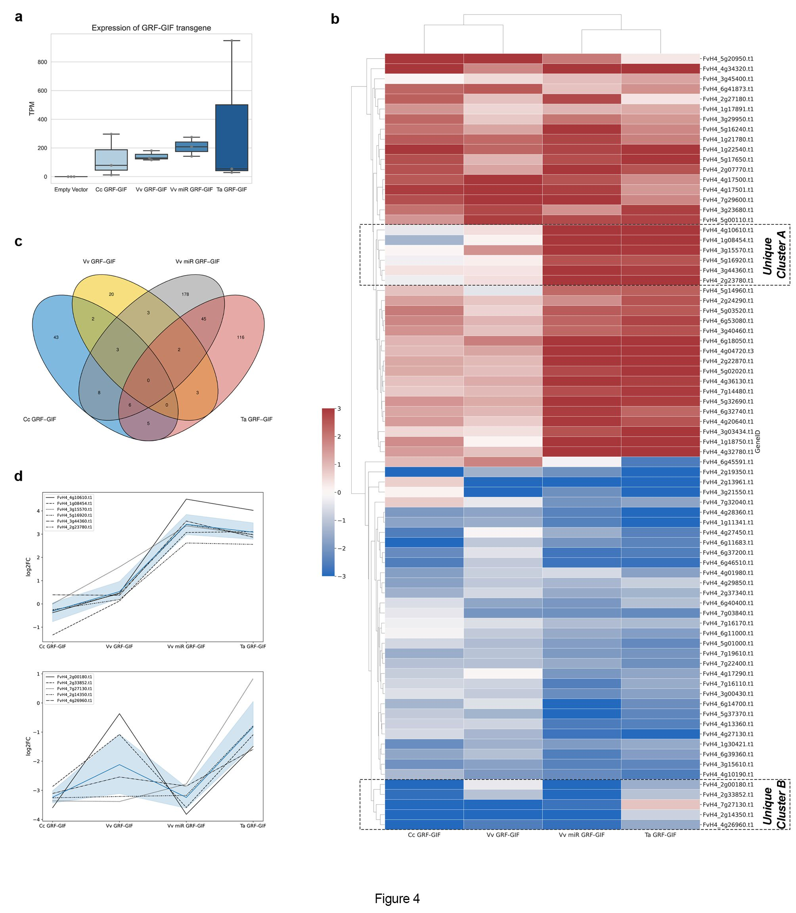

# H4 GRF-GIF Transcriptomic Analysis
Documentation for the analysis of RNA-seq data from *Fragaria vesca* Hawaii 4 GRF-GIF transformations using the v4.0.a2 reference genome on [GDR](https://www.rosaceae.org/).

## Key
<table>
    <tr><th>Construct</th><th>Condition</th></tr>
    <tr><td>pK7WG2D</td><td>Control</td></tr> 
    <tr><td>p553</td><td>Ta GRF-GIF</td></tr> 
    <tr><td>p630</td><td>Vv GRF-GIF</td></tr> 
    <tr><td>p689</td><td>Cc GRF-GIF</td></tr> 
    <tr><td>p638</td><td>Vv miR GRF-GIF</td></tr>
</table>

## Quality Control
Check quality of reads using FastQC.
```bash
for file in *.fq.gz; 
    do sbatch ../scripts/fastqc.sh $file
    done
```
Remove adapters and low quality sequence using Trimmomatic (ILLUMINACLIP, HEADCROP:10, SLIDINGWINDOW:4:20, MINLEN:100).
```bash
for file1 in ../raw/*_1.fq.gz; 
    do file2=$(ls $file1 | sed s/"_1.fq.gz"/"_2.fq.gz"/g)
    sbatch ../scripts/trimmomatic_pe.sh $file1 $file2
    done
```
## Align reads and quantify
Index genome using HISAT2 prior to alignment.
```bash
sbatch scripts/hisat2_index.sh Fragaria_vesca_v4.0.a1.fasta genome_index/
```

Align all reads to the *F. vesca* genome using HISAT2.
```bash
for file1 in ../trimmed/*F_paired.fastq.gz; 
    do file2=$(ls $file1 | sed s/"F_paired"/"R_paired"/g)
    sbatch ../scripts/hisat2_pe-map.sh ../genome_index/Fragaria_vesca_v4.0.a1 $file1 $file2
    done
```

Generate count data for each sample using FeatureCounts.
```bash
for file in ../mapping/*bam;
    do sbatch ../scripts/featurecounts.sh $file ../Fragaria_vesca_v4.0.a2.genes.gff3
    done
```

## Differential expression testing and plotting
Perform differential expression analysis using DESeq2 in RStudio.
```
DESeq2.R
```

Plot Venn diagram of shared DEGs using ggvenn in RStudio.
```
venn_diagram.R
```

Plot heatmap of the log2FC expression and hierarchical clustering of shared DEGs using seaborn in Jupyter Notebook. 
```
Shared DEGs Heatmap.ipynb
```

TPM normalise counts using bioinfokit and plot values for transgenes using seaborn in Jupyter Notebook.
```
GRF-GIF Count Plots.ipynb
```

## Functional Annotation
Assign functional annotations to determine function of DEGs.
```bash
sbatch ../scripts/interproscan.sh ../Fragaria_vesca_v4.0.a2.proteins.fa
```

## Citation

Sanchez, E.R., **Price, R.J.**, Marangelli, F. et al. [Overexpression of Vitis GRF4-GIF1 improves regeneration efficiency in diploid Fragaria vesca Hawaii 4.](https://doi.org/10.1186/s13007-024-01270-8) Plant Methods 20, 160 (2024). 

<br>

<center></center>
